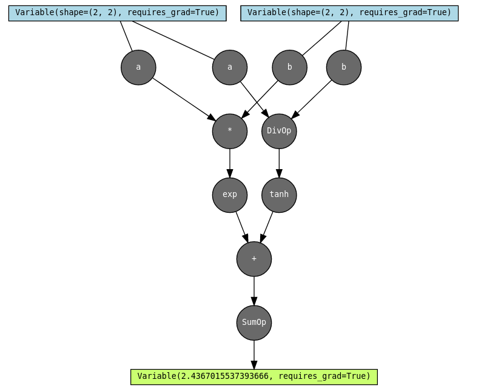
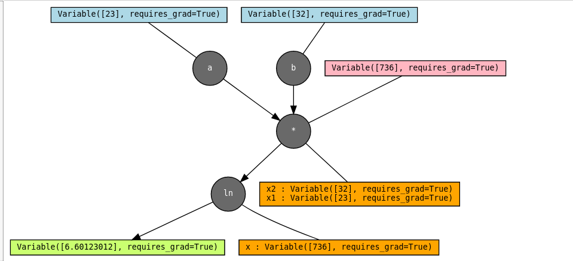
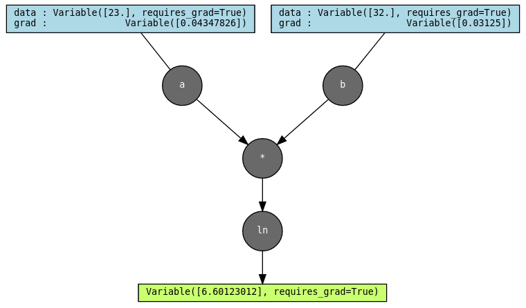

# Clove

Clove is an automatic differentiation engine with a pytorch autograd like api and the ability to toggle numerical computation backends (currently implements `numpy` and `cupy`). It supports higher order backward-mode (vjp), forward-mode (jvp) and mixed mode autodiff.

Clove also implements a jax like functional differentiation module to take derivatives of arbitrary python functions.

Computations can be performed with specific backends :

```py
from clove import numpy as cnp

x = cnp.ones((2,2), requires_grad = True)
y = cnp.sum(x)
y.backward()
```

Or directly from the clove namespace (with the current backend): 

```py
import clove

x = clove.ones(2,2, requires_grad = True)
y = clove.sum(x)
y.backward()
```

the default backend is `'numpy'` and can be toggled using `clove.set_backend('backend_name')`

Clove has inbuilt `graphviz` extensions to visualize your computation graphs as you build them:

```py
import clove

a = clove.ones(2,2, requires_grad = True, name='a')
b = clove.randn(2,2, requires_grad = True, name='b')
c = a / b
d = a * b
e = clove.exp(d)
f = c.tanh()
g = e + f
h = g.sum()
clove.make_dot(h)
```



You can also visualize intermediate outputs and cached values for backward as you move along in your computation:

```py
a = clove.array([23.], requires_grad=True, name='a')
b = clove.array([32.], requires_grad=True, name='b')
c = a * b
d = c.log()
clove.make_dot(d,show_intermediate_outs=True, show_saved=True)
```



And see the value of computed gradients on backward:

```py
d.backward()
clove.make_dot(d, show_saved=True, show_grads=True)
```




Notice the saved values are gone, as performing the backward cleared the cache.


Like JAX, grads of functions can be taken just as easily:

```py
import clove

sigmoid = lambda x: 1/(1+clove.exp(-x))

sigmoid_grad = clove.grad(sigmoid)

print(sigmoid_grad(2.0))
```
